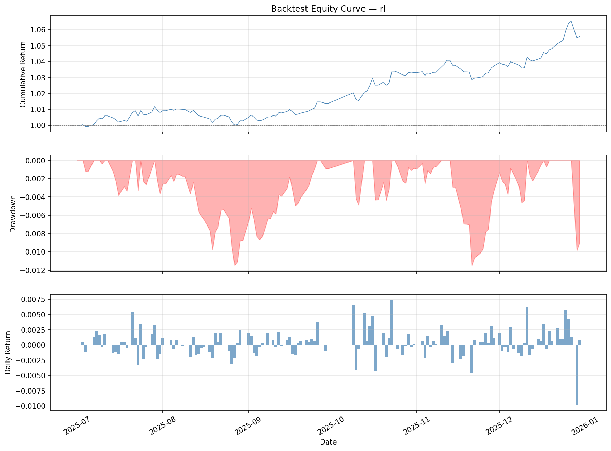
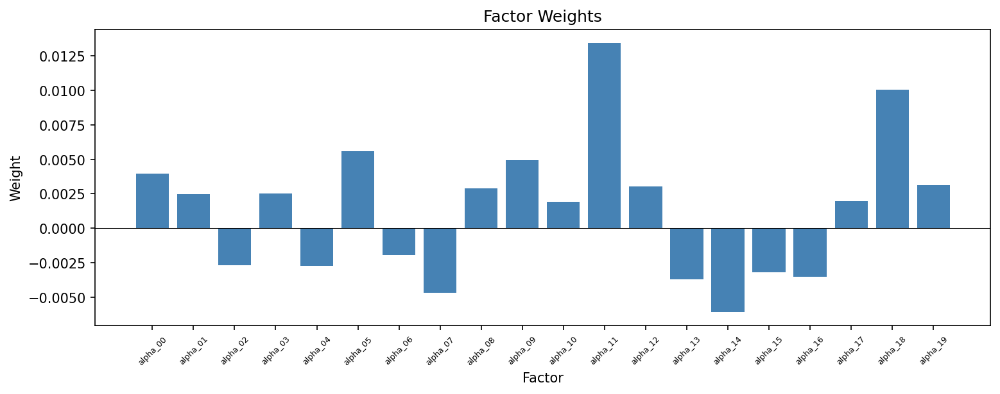
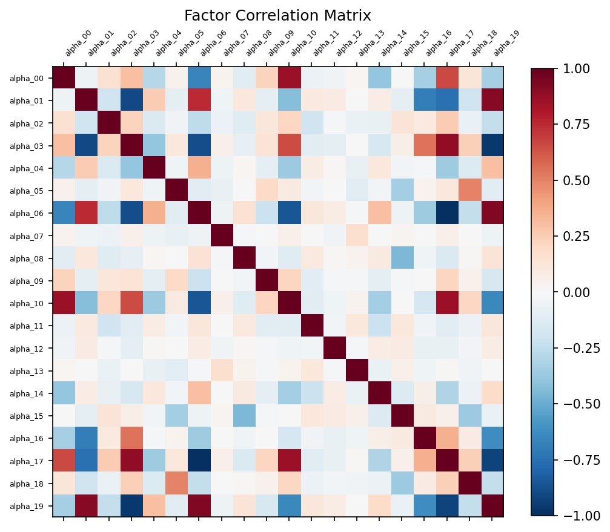

# AlphaGen

Automatic formulaic alpha generation with reinforcement learning.

> Original work: *Generating Synergistic Formulaic Alpha Collections via Reinforcement Learning*, KDD 2023.  
> Repository: [github.com/ICT-FinD-Lab/alphagen](https://github.com/ICT-FinD-Lab/alphagen)  
> Maintained by MLDM research group, [IIP, ICT, CAS](http://iip.ict.ac.cn/).

## 快速使用

### 1. 数据准备

将原始 CSV 数据转换为 qlib 二进制格式：

```bash
# 1) 确保 qlib_data/ 目录下有 ins_data_all.csv（多品种单文件）
# 2) 按品种拆分 CSV 并对齐到临时目录
# 3) 运行 dump 脚本
uv run python -m data_collection.qlib_dump_bin dump_all \
    --csv_path qlib_data/tmp \
    --qlib_dir qlib_data \
    --freq 5min \
    --date_field_name datetime \
    --exclude_fields "index,code,time"
```

输出结构：
```
qlib_data/
├── calendars/
│   └── 5min.txt      # 交易日历（5 分钟线）
├── instruments/
│   └── all.txt       # 品种列表及起止时间
└── features/
    └── {code}/        # 每个品种一个子目录
        ├── open.5min.bin
        ├── high.5min.bin
        ├── low.5min.bin
        ├── close.5min.bin
        ├── volume.5min.bin
        ├── amount.5min.bin
        └── ...
```

### 2. 配置文件

所有运行参数集中在 `symbol_config.json`，主要节点：

| 节点 | 说明 | 关键字段 |
|------|------|---------|
| `qlib_data_path` | 数据目录 | `"qlib_data"` |
| `instruments` | 品种集合 | `"all"`（全部）或单品种 |
| `device` | 计算设备 | `"cpu"` / `"cuda:0"` |
| `freq` | 数据频率 | `"5min"` |
| `data` | 训练/测试时间段 | `train_start`, `train_end`, `test_segments` |
| `target_horizon` | 预测目标步数 | `20`（5min 线 20 步 ≈ 100 分钟） |
| `llm` | LLM API 配置 | `base_url`, `api_key`, `model`, `model_max_tokens` |
| `rl` | 强化学习超参 | `pool_capacity`, `ppo`, `lstm_network`, `steps_default` |
| `llm_only` | 纯 LLM 实验参数 | `pool_size`, `n_replace`, `n_updates` |
| `backtest` | 回测参数 | `benchmark`, `top_k`, 手续费等 |
| `gp` / `dso` | 基线方法参数 | GP 进化参数 / DSO 训练参数 |
| `paths` | 输出路径 | `save`, `tensorboard`, 各测试输出目录 |

临时测试建议创建独立配置文件（如 `test_config.json`），使用极小时间段验证流程。

### 3. 运行脚本

从项目根目录以模块方式运行：

```bash
# 主实验 / 强化学习 alpha 挖掘
uv run python -m scripts.rl \
    --config_path test_config.json \
    --steps 50 --pool_capacity 2

# 纯 LLM 迭代生成 alpha
uv run python -m scripts.llm_only \
    --config_path symbol_config.json \
    --pool_size 5 --n_updates 3

# LLM 输出有效性测试
uv run python -m scripts.llm_test_validity \
    --config_path symbol_config.json \
    --n_repeats 5

# 遗传规划基线
uv run python gp.py 0 --config_path test_config.json

# 深度符号回归基线
uv run python dso.py 0
```

> **注意**：测试时务必使用极短时间范围（如 `test_config.json`），避免全量运行导致长时间计算。

### 4. 输出

- Model checkpoint & alpha pool → `paths.save` 目录
- TensorBoard 日志 → `paths.tensorboard` 目录
- 回测结果 → `paths.backtest_output` 目录

---

## 因子检验

基于 87 个期货品种（5min 频率）的 RL 训练结果。实验参数：pool_capacity=20，steps=251,904。

### RL 因子表达式

最终因子池共 20 个 alpha，权重经 RL 优化：

| # | 因子表达式 | 权重 |
|---|-----------|------|
| 0 | `Sum(Div(-5.0, Mul(Greater($open, 1.0), Add(-0.5, $volume))), 20d)` | +0.0043 |
| 1 | `Add(Var($close, 5d), Sub(-0.5, Log($high)))` | −0.0030 |
| 2 | `Less(Log($close), Cov($close, Greater(Greater($close, Greater($volume, -30.0)), -10.0), 5d))` | −0.0033 |
| 3 | `Sub(-1.0, Corr($volume, Div(10.0, $high), 20d))` | −0.0070 |
| 4 | `Div(-30.0, Delta($high, 10d))` | −0.0028 |
| 5 | `Add(-2.0, Var(Greater($high, $volume), 5d))` | +0.0047 |
| 6 | `Sub(10.0, WMA($volume, 20d))` | −0.0036 |
| 7 | `Cov($volume, Greater($high, 1.0), 5d)` | −0.0038 |
| 8 | `Div(-0.01, Sum(Sub(Less($volume, $low), $high), 1d))` | +0.0027 |
| 9 | `Cov(Abs(Div(-1.0, $open)), $volume, 10d)` | +0.0034 |
| 10 | `Div(-1.0, Var($low, 10d))` | +0.0037 |
| 11 | `Add(1.0, Div($low, $close))` | +0.0113 |
| 12 | `Sub(-1.0, Abs(Sub(Mul(Delta(Div($volume, -30.0), 20d), 0.01), -0.5)))` | +0.0032 |
| 13 | `Less(5.0, Div(Div($close, 5.0), WMA($close, 20d)))` | −0.0058 |
| 14 | `Delta(Div(2.0, $close), 20d)` | −0.0075 |
| 15 | `Div($volume, Greater($high, -5.0))` | +0.0022 |
| 16 | `Less(Add(Sub(-1.0, EMA($volume, 40d)), $high), 2.0)` | −0.0042 |
| 17 | `Add(Sub(5.0, Div(Less($close, $open), $low)), -0.01)` | +0.0031 |
| 18 | `Std(Greater(Add(5.0, $close), $volume), 10d)` | +0.0100 |
| 19 | `Add(0.01, Min(Div($volume, Std($close, 5d)), 40d))` | +0.0036 |

### 回测表现

测试区间 2025-07-01 ~ 2025-12-31，初始资金 1000 万，手续费 0.15%/万 5 最低：

| 指标 | 数值 |
|------|------|
| Sharpe 比率 | 1.3191 |
| 年化收益率 | 4.469% |
| 最大回撤 | −1.19% |
| 信息比率 | — (无基准) |
| 年化超额收益 | — (无基准) |

### 因子 IC 分析

IC 最强的 5 个因子（Rank IC IR）：

| 因子 | IC Mean | IC IR | RankIC Mean | RankIC IR |
|------|---------|-------|-------------|-----------|
| alpha_07 | +0.0767 | 0.2212 | +0.0754 | 0.2574 |
| alpha_13 | +0.3157 | 0.8371 | +0.2801 | 0.8750 |
| alpha_18 | +0.0088 | 0.0239 | +0.0048 | 0.0147 |
| alpha_19 | +0.0041 | 0.0261 | +0.0045 | 0.0263 |
| alpha_03 | +0.0088 | 0.0258 | +0.0028 | 0.0097 |

IC 最弱的 2 个因子：

| 因子 | IC Mean | IC IR | RankIC Mean | RankIC IR |
|------|---------|-------|-------------|-----------|
| alpha_11 | −0.4556 | −1.1379 | −0.4149 | −1.2504 |
| alpha_14 | −0.0752 | −0.2333 | −0.0925 | −0.3210 |

### 可视化

**权益曲线 (RL)**




**因子权重分布**



**因子相关性矩阵**



> **注意**：当前结果基于无基准回测（`benchmark=null`），超额收益相关指标均为 0。

---

## Citing original work

```bibtex
@inproceedings{alphagen,
    author = {Yu, Shuo and Xue, Hongyan and Ao, Xiang and Pan, Feiyang and He, Jia and Tu, Dandan and He, Qing},
    title = {Generating Synergistic Formulaic Alpha Collections via Reinforcement Learning},
    year = {2023},
    doi = {10.1145/3580305.3599831},
    booktitle = {Proceedings of the 29th ACM SIGKDD Conference on Knowledge Discovery and Data Mining},
}
```

## Original contributors

This work is maintained by the MLDM research group, [IIP, ICT, CAS](http://iip.ict.ac.cn/).

Maintainers include:

- [Hongyan Xue](https://github.com/xuehongyanL)
- [Shuo Yu](https://github.com/Chlorie)

Thanks to the following contributors:

- [@yigaza](https://github.com/yigaza)
